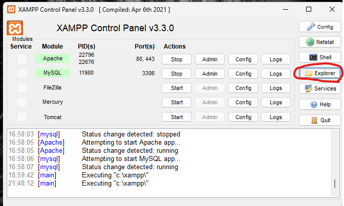

# Database Re-engineering

Questo progetto visualizza i dati sul traffico su una mappa interattiva utilizzando sovrapposizioni di heatmap per mostrare la densità dei veicoli in base alla posizione e al tempo. Il progetto originario è stato sviluppato per visualizzare i dati sulla mappa tramite **Leaflet** e **Heatmap.js**, con il supporto di PHP per il recupero e l'elaborazione dei dati.

## Obiettivo del Progetto

Il progetto iniziale era già sviluppato da un altro tesista e prevedeva la visualizzazione del traffico sulla mappa. In questo lavoro, è stato svolto un processo di reingegnerizzazione del database per:

-   **Normalizzare i dati** e migliorare la struttura del database.
-   **Aggiungere funzionalità di registrazione, login e modifica password** per gestire l'accesso utenti.
-   **Facilitare l'inserimento dei dati** tramite un'interfaccia user-friendly.
-   **Ottimizzare l'applicazione** per utilizzare il nuovo database normalizzato.

## Caratteristiche

-   **Mappa Interattiva**: Visualizza i dati sul traffico con sovrapposizioni di heatmap.
-   **Nuovo Database Normalizzato**: Dati ristrutturati per migliorare le performance e la coerenza.
-   **Gestione Utente**: Pagina di registrazione, login e modifica password.
-   **Interfaccia di Inserimento Dati**: Applicazione per facilitare l'inserimento e gestione dei dati di traffico.

## Configurazione del Progetto

### Prerequisiti

-   **XAMPP** (consigliato per un ambiente locale, include sia PHP che MySQL). Può essere installato da [questo link](https://www.apachefriends.org/download.html).

-   **Node.js** (necessario per eseguire il comando `npm install`). Può essere scaricato da [questo link](https://nodejs.org/).

### Passaggi Preliminari

1. **Copia del Repository**:

    - Apri il **Prompt dei comandi** (CMD) e posizionati nella cartella `xampp\htdocs`:

        ```bash
        cd C:\xampp\htdocs
        ```

    - Clona il repository eseguendo il comando:

        ```bash
        git clone https://github.com/AndreaZavatta/tesi_zavatta.git
        ```

    - Questo comando copierà il repository nella cartella `htdocs` di XAMPP.

2. **Naviga nella Cartella del Progetto**:

    - Dopo aver clonato il repository, vai nella cartella del progetto:
        ```bash
        cd tesi_zavatta/project
        ```

3. **Installa le Dipendenze**:

    - Esegui il seguente comando per installare le dipendenze necessarie:
        ```bash
        npm install
        ```

### Avviare Apache, MySQL con XAMPP e il server Node.js

1. **Avviare il server Node.js**:

    - Naviga nella cartella `votazioni` del progetto.
    - Apri un terminale nella cartella e digita:

        ```bash
        node server.js
        ```

    - Assicurati che il terminale rimanga aperto per mantenere attivo il server.

2. **Avvia XAMPP Control Panel**:

    - Dopo aver installato XAMPP, apri il **XAMPP Control Panel**.

3. **Avvia Apache e MySQL**:

    - Nella sezione **Modules**, troverai **Apache** e **MySQL**.
    - Fai clic su **Start** accanto a entrambi i moduli.
    - Quando i moduli saranno attivi, vedrai lo stato **running** accanto a ciascuno, come mostrato nell'immagine qui sotto:

        

4. **Problemi con MySQL sulla porta 3306**:

    - Se MySQL non si avvia, potrebbe esserci un altro processo che sta già utilizzando la porta 3306.
    - Per verificare quale processo sta usando quella porta, apri il **Prompt dei comandi** come amministratore e digita il seguente comando:
        ```bash
        netstat -ano | findstr :3306
        ```
    - Questo comando ti mostrerà l'ID del processo (PID) che sta utilizzando la porta. Prendi nota del PID.
    - Una volta identificato il processo, puoi terminarlo con il seguente comando:
        ```bash
        taskkill /PID <PID> /F
        ```
    - Sostituisci `<PID>` con il numero del processo che hai trovato (ad esempio, `taskkill /PID 6604 /F`).

5. **Verifica MySQL tramite Admin**:

    - Dopo aver avviato MySQL, fai clic sul pulsante **Admin** accanto a MySQL nel pannello di controllo di XAMPP, come mostrato nell'immagine seguente:

        

    - Questo ti aprirà **phpMyAdmin** in un browser, dove puoi verificare che tutto funzioni correttamente e accedere al tuo database.

6. **Aggiunta Utente in phpMyAdmin**:

    - Una volta aperto phpMyAdmin, è consigliabile creare un nuovo utente per gestire le connessioni al database in modo più sicuro.
    - Per aggiungere un nuovo utente:

        1. Clicca sulla scheda **User accounts** (Account utente) nella parte superiore della pagina.
        2. Clicca su **Add user account** (Aggiungi account utente).
        3. Inserisci il **Username** e seleziona il **Host name** (ad esempio `localhost`).
        4. Imposta una **Password** sicura e confermala.
        5. Nella sezione **Database for user**, puoi scegliere di creare un database per l'utente o concedere i privilegi su un database esistente.
        6. Sotto la sezione **Global privileges**, seleziona i privilegi appropriati per l'utente.
        7. Clicca su **Go** per creare l'account.

    - In questo modo, avrai un accesso più sicuro e specifico al tuo database.

    

    ### Configurazione del File db_config.json

Una volta creato l'utente, è necessario inserire i dati di connessione nel file `db_config.json`. Dopo aver registrato un nuovo utente nel tuo sistema:

-   **Aggiungi i seguenti dettagli nelle prime righe del file** `db_config.json`:

```php
{
	"host": "localhost",
	"user": "root",
	"password": "ErZava01",
	"database_votazioni": "votazioni",
	"database_mappa": "mappa"
}
```

### Aggiornare il file php.ini

Per modificare le impostazioni di PHP, è necessario aggiornare il file `php.ini`. Segui i passaggi seguenti:

1. **Apri il Pannello di Controllo di XAMPP**:

    - Dopo aver avviato XAMPP, apri il **XAMPP Control Panel**.

2. **Clicca su 'Explorer'**:

    - Nel pannello di controllo di XAMPP, clicca sul pulsante **Explorer** (evidenziato nell'immagine qui sotto) per aprire la cartella di installazione di XAMPP.

    

3. **Naviga alla Cartella PHP**:

    - Nella cartella di XAMPP, vai alla sottocartella `php`.

4. **Apri il File php.ini**:

    - Trova il file `php.ini` all'interno della cartella `php`.

5. **Sostituisci il Contenuto del File**:

    - Apri il file `php.ini` con un editor di testo (ad esempio, Notepad++).
    - Sostituisci tutto il contenuto del file con quello fornito nella directory di progetto, se presente. Assicurati di mantenere una copia di backup del file originale prima di effettuare modifiche.

6. **Riavvia Apache**:

    - Dopo aver salvato le modifiche al file `php.ini`, riavvia il server Apache nel pannello di controllo di XAMPP affinché le nuove impostazioni abbiano effetto.

## Processo di Registrazione e Accesso

1. **Registrazione**:

    - Compila il modulo di registrazione a [questo link](http://localhost/tesi_zavatta/project/LoginRegistration/register.php) fornendo un **username**, una **password** sicura e i dettagli di connessione al database (host, porta, username e password del database).
    - Dopo aver completato la registrazione, verrai reindirizzato alla schermata di accesso.

2. **Accesso**:
    - Dopo essersi registrati si verrà rediretti direttamente alla pagina di registrazione che si può trovare anche a [questo link](http://localhost/tesi_zavatta/project/LoginRegistration/login.php)
    - Inserisci le tue credenziali (username e password) nella schermata di accesso.
    - Se il login ha successo, sarai reindirizzato alla pagina principale dell'applicazione.

# Caricamento delle Tabelle

L'applicazione è suddivisa in due sezioni principali:

1. **Gestione delle Votazioni**  
   Questa parte dell'applicazione permette di caricare e visualizzare i dati relativi alle votazioni politiche. Potrai caricare i dati in formato JSON tramite l’interfaccia, che provvederà poi a visualizzarli e renderli disponibili per l’analisi.

2. **Rilevazione del Flusso Veicolare tramite Spire**  
   Questa sezione è dedicata alla gestione dei dati delle rilevazioni del flusso veicolare tramite spire, che puoi ottenere seguendo questi passaggi:

    ### Scarica i Dati degli Open Data

    Vai al seguente link: [Rilevazione flusso veicoli tramite spire](https://opendata.comune.bologna.it/explore/?q=Rilevazione+flusso+veicoli+tramite+spire&sort=modified)

    ### Filtra i Risultati

    Cerca i dataset chiamati **"Rilevazione flusso veicoli tramite spire"**. Potrai scegliere i dati di diversi anni.

    ### Scarica i Dati

    Clicca sul dataset di tuo interesse e seleziona l'opzione per scaricare il file in formato CSV.

    ### Carica i Dati nell'Applicazione

    Una volta scaricato il file CSV, utilizza l'interfaccia per caricare i dati. Tieni presente che il caricamento nel database può richiedere del tempo e può essere interrotto in qualsiasi momento, lasciando comunque i dati già inseriti nel sistema.

## Funzionalità Aggiuntive

-   **Eliminazione delle Tabelle**  
     Nell’interfaccia sono presenti pulsanti per eliminare le tabelle relative sia al flusso veicolare che alle votazioni.

-   **Visualizzazione Informazioni Utente**  
     Puoi vedere le informazioni dell’utente autenticato.

-   **Modifica Password**  
     È possibile modificare la password dell’utente tramite l’interfaccia.

### Avvio dell'Applicazione

Una volta completata correttamente la configurazione e il caricamento dei dati, puoi accedere facilmente alle due applicazioni direttamente dalla **Dashboard**:

-   **Mappa del Traffico**: Seleziona i vari checkbox disponibili per attivare o disattivare le sovrapposizioni sulla mappa e analizzare i dati sul traffico in base alle tue preferenze.
-   **Votazioni**: Accedi all'applicazione per visualizzare e analizzare i dati relativi alle votazioni politiche.

Ogni sezione è facilmente accessibile e ti permette di navigare tra i dati caricati in modo efficace.


## Conclusione

La reingegnerizzazione del database ha rappresentato un passaggio fondamentale per migliorare la gestione e l'efficienza dei dati all'interno del progetto, adesso il progetto è uno strumento versatile e robusto per l'analisi dei dati sul traffico e delle votazioni.

Le seguenti migliorie principali sono state implementate:

-   **Ottimizzazione della Struttura Dati**: Grazie a un processo di normalizzazione e suddivisione logica delle tabelle, è stata migliorata la referenzialità e ridotta la ridondanza dei dati. La nuova struttura consente una gestione più efficiente e semplificata, adatta a future espansioni.

-   **Sicurezza e Accesso Controllato**: L'aggiunta delle funzionalità di registrazione e login migliora la sicurezza dell'applicazione, permettendo un controllo accurato dell'accesso ai dati e preservando l'integrità delle informazioni sensibili.

-   **Esperienza Utente Intuitiva per il Caricamento e la Visualizzazione**: L'interfaccia user-friendly per il caricamento dei dati permette di inserire dataset ampi in modo semplice e controllato, con feedback di avanzamento che migliorano l’esperienza utente. La **Dashboard** centralizzata consente un facile accesso alle applicazioni per la visualizzazione sia dei dati sul traffico sia delle votazioni, offrendo strumenti di filtro e visualizzazione personalizzati.

Questi cambiamenti hanno reso il sistema non solo più performante, ma hanno anche gettato solide basi per futuri sviluppi e funzionalità avanzate. La reingegnerizzazione e le ottimizzazioni introdotte permettono al progetto di espandersi verso nuove capacità di analisi e visualizzazione, trasformandolo in una piattaforma efficiente per monitorare e comprendere sia le dinamiche del traffico sia le statistiche relative alle votazioni.

Continueremo a esplorare ulteriori ottimizzazioni e a promuovere la partecipazione della comunità per il miglioramento continuo del progetto.
